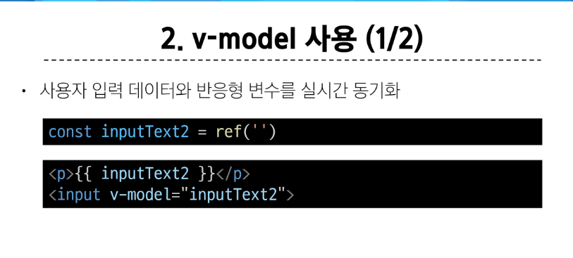
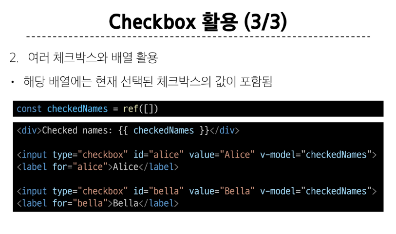
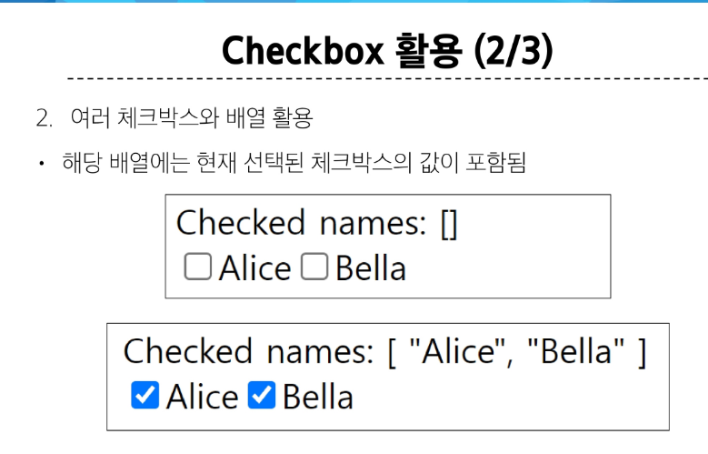
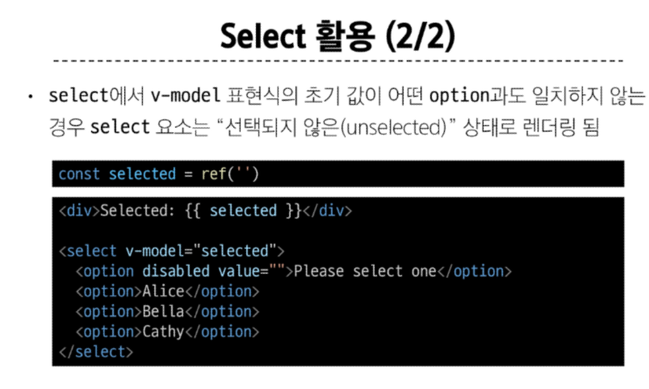
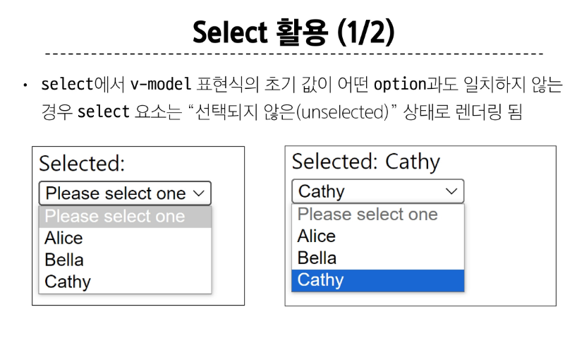

# Template Syntax
DOM을 기본 구성 요소 인스턴스의 데이터에 선언적으로 바인딩할 수 있는 HTML 기반 템플릿 구문을 사용

종류 
1. Text Interpolation
2. Raw HTML
3. Attributr Bindings
4. JavaScript Expressions

## Text Interpolation
```js
<p>Message : {{ msg} } </p>
```
- 데이터 바인딩의 가장 기본적인 형태
- 이중 중괄호 구문을 사용
- 콧수염 구문은 해당 구성 요소 인스턴스의 msg속성 값으로 대체
- msg 속성이 변경될 때마다 업데이트 됨

## Raw HTML
```js
<div v-html = "rawHtml"></div>
const rawHtml = ref('<span style = "color:red">This should be red.</span>')
```
- 콧수염 구문은 데이터를 일반 텍스트로 해석하기 때문에 실제 HTML을 출력하려면 v-html을 사용해야 함

## Attribute Bindings
```js
<div v-bind:id ="dynamicID"></div>

const dynamicId = ref('my-id')
```
- 콧수염 구문은 HTML 속성 내에서 사용할 수 없기 때문에 v-bind를 사용
- HTML의 id 속성 값을 vue의 dynamicId 속성과 동기화 되도록 함
- 바인딩 값이 null이나 undefind인 경우 렌더링 요소에서 제거됨

## JavaScript Expressions
```js
{{ number +1}}
{{ok ? 'YES':'NO' }}
{{message.split('').reverse().join('')}}

<div v-bind:id ="`list-${id}`"></div>
```
- Vue는 모든 데이터 바인딩 내에서 JavaScript 표현식의 모든 기능을 지원
- Vue 템플릿에서 JavaScript 표현식을 사용할 수 있는 위치
  1. 콧수염 구문 내부
  2. 모든 directive의 속성 값
## 주의사항
- 각 바인딩에는 하나의 단일 표현식만 포함될 수 있음
  - 표현식은 값으로 평가할 수 있느 ㄴ코드 조각

## Directive
'v-' 접두사가 있는 특수 속성

표현식 값이 변경될 때 DOM에 반응적으로 업데이트를 적용


#### Direcrive - 'Arguments'
- 일부 directive는 direcrtive 뒤에 콜론으로 표시되는 인자를 사용할 수 있음
- 아래 예시의 href는 HTML <a> 요소의 href 속성 값을 myUrl 값에 바인딩 하도록 하는 v-bind의 인자
```js
<a v-bind:href="myUrl">Link</a>
```
- 아래 예시의 click은 이벤트 수신할 이벤트 이름을 작성하는 v-on의 인자

```js
<button v-on:click="doSomething">byutton</button>
```

#### Direcrive - 'Modifiers'
- .로 표시되는 특수 접미사로, directive가 특별한 방식으로 바인딩되어야 함을 나타냄
- 아래 예시의 .prevent는 발생한 이벤트에서 event.preventDefault()를 호출하도록 v-on에 지시하는 modifier
```html
<form v-on:submit.prevent="onSubmit">
  <input type="submit">
</form>
```

# v-bind 사용처
1. Attribute Bindings
2. Class and Style Bindings

#### Attribute Bindings
- HTML의 속성 값을 Vue의 상태 속성 값과 동기화 되도록함
```html

<a v-bind:href= "myUrl">Move to url </a>
```
- v-bind shorthand
  - :
```html

<a :href="myUrl">Move to url</a>
```
#### Dynamic attribute name(동적 인자 이름)
- 대괄호([])로 감싸서 directive argument에 JavaScript 표현식을 사용할 수 있음
- 표현식에 따라 동적으로 평가된 값이 최종 argument 값으로 사용됨
```html
<button :[key] = 'myValue'></button>
<!-- 대괄호 안에 작성하는 이름은 반드시 소문자로만 -->
```


#### Class and Style Bindings
사용 가능한 경우
1. Binding HTML Classes
   1. Binding to Objects
   2. Binding to Arrays
2. Binding Inline Styles
  1. Binding to Objects
2.  Binding to Arrays

1.1 
- 객체를 :class에 전달하여 클래스를 동적으로 전환할 수 있음
  - isActive의 Boolean 값에 의해 active 클래스의 존재가 결정됨
```html
const isActive = ref(false)

<div :class="{ active:isActive}">Text</div>
```
- 객체에 더 많은 필드를 포함하여 여러 클래스를 전환할 수 있음
  - :class directive를 일반 클래스 속성과 함께 사용 가능
```html
const isActive = ref(false)
const hasInfo = ref(true)

<div class="static" : class = "{acitve : isActive, 'text-primary':hasInfo}"> Text</div>

<div class ="static text-primary">Text</div>
```
- 반드시 inline 방식을 작성하지 않아도 됨
- 반응형 변수를 활용해 객체를 한번에 작성하는 방법
```html
const isActive = ref(false)
const hasInfo = ref(true)

const classObj = ref({
  active:isActive,
  'text-primary' : hasInfo
})

<div class="static" :class="classObj">Text</div>
```
#### 1.2


#### 2.1


#### 2.2


# Event Handling

### v-on
- handler 종류
  1. inline handlers : 이벤트가 트리거 될 떄 실행 될 javascript코드
  2. Method handlers : 컴포넌트에 정의된 메서드 이름

- v-on shorthand
  - '@'
```js
@event = "handler"
```
### Inline Handlers에서의 event 인자에 접근하기


## Form Input Bindings (폼 입력 바인딩)
- form을 처리할 때 사용자가 input에 입력하는 값을 실시간으로 JavaScript 상태에 동기화해야 하는 경우 (양방향 바인딩)
- 양방향 바인딩 방법
  1. v-bind와 v-on을 함께 사용
  2. v-model 사용

# v-model
form input 요소 또는 컴포넌트에서 양방향 바인딩을 만듦


ime가 필요한 언어(한국어, 중국어, 일본어 등) 제대로 업데이트가  되지않아 v-bind와 v-on 방법 필요

#### Checkbox 활용



#### Select 활용

